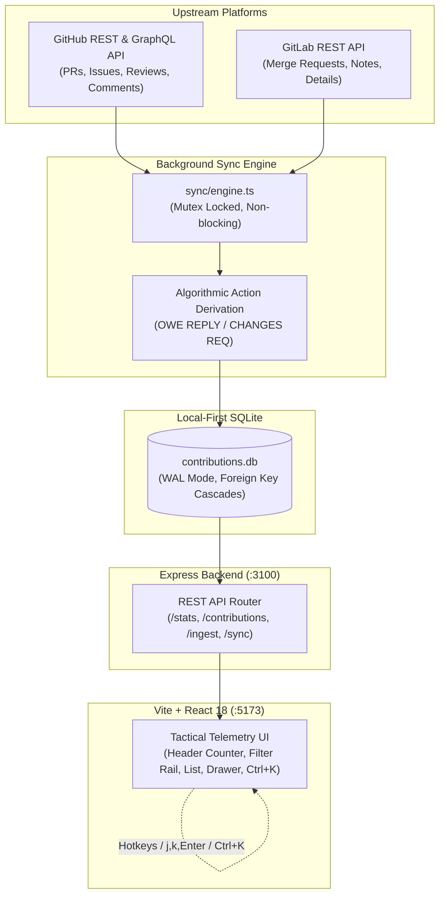

# ⚡ OSS Contribution Command Center

> **A local-first, high-density telemetry command center for open-source contributors and bounty hunters to track, triage, and manage pull requests and issues across GitHub and GitLab.**

[](https://opensource.org/licenses/MIT)
[](https://nodejs.org/)
[](https://www.sqlite.org/wal.html)
[](https://react.dev/)
[]()

---

## 🎯 The Problem It Solves

If you contribute to open-source projects across both **GitHub** and **GitLab** (or hunt bounties across repositories), keeping track of where conversations stand is a massive operational headache:
- **Scattered Notifications**: Important maintainer feedback gets lost in noisy email feeds or notification tabs.
- **Manual Overhead**: Dashboards either don't exist across both platforms or require you to hand-triage every issue yourself.
- **Unclear Action States**: You can't instantly see where **you owe a reply**, where **code changes were requested**, or where you are waiting on a maintainer.
- **Forgotten Inactive Work**: Year-old untouched issues blend in with items opened 2 days ago.

**OSS Command Center** replaces this chaos with an automated, local-first operational deck.

---

## ⚡ Key Capabilities

### 1. Algorithmic Action Derivation (Zero Manual Triage)
Instead of forcing you to toggle states by hand, the background sync engine ingests the complete conversation stream (comments, reviews, review comments, and merge events) and automatically derives what needs attention:
- **`OWE REPLY`**: Maintainer commented or replied last.
- **`CHANGES REQ`**: Upstream reviewer requested changes (`CHANGES_REQUESTED`).
- **`AWAITING MAINTAINER`**: You replied or pushed code last, waiting on maintainer review.

### 2. Multi-Platform Aggregation (GitHub + GitLab)
- Single unified stream combining GitHub pull requests/issues and GitLab merge requests (e.g. RTEMS upstream).
- Normalized status tokens (`OPEN`, `MERGED`, `DRAFT`, `CLOSED`).

### 3. Staleness & Inactivity Visibility
- **Active ($< 30$ days)**: Highlighted for immediate work.
- **Stale ($30$–$89$ days)**: Tagged with amber indicator `[STALE: Xd]`.
- **Dormant ($\ge 90$ days)**: High-visibility hazard badge `[DORMANT: 436d]`, with title visually dimmed so inactive work never distracts from active priorities.
- Instant view tabs: `[ALL]`, `[ACTIVE]`, `[ACTION NEEDED]`, `[STALE]`, `[MERGED]`.

### 4. Context-Preserving Slide-Over Drawer
- Click or press `Enter` on any row to open a full inspection drawer with the chronological conversation stream and editable triage notes.
- **Zero navigation**: Drawer slides over without disturbing your list position, filter selections, or scroll state.

### 5. Tactical Telemetry & Industrial Brutalism
- Space Grotesk headers, JetBrains Mono data telemetry, IBM Plex Sans body typography.
- 90° razor borders, calibrated contrast, zero generic AI design tells (no soft blur dropshadows, no purple gradient blobs).
- **Responsive Card Layout**: Mobile viewports ($< 768$px) automatically switch to stacked tactical cards without column squashing or badge clipping.

### 6. Power-User Keyboard Navigation
- `j` / `↓`: Move selection cursor down.
- `k` / `↑`: Move selection cursor up.
- `Enter`: Open slide-over detail drawer for selected contribution (marks as read locally).
- `Esc`: Close drawer or dismiss command palette.
- `Ctrl+K`: Global command palette to search by repo, title, PR number, or triage notes.

### 7. CLI / AI Agent Ingest Endpoint
- Direct `POST /api/ingest` endpoint to pipe newly discovered issues or bounties directly from terminal workflows or AI agent planning sessions (`Antigravity`, `Claude Code`, `Cursor`, etc.) into your local database.

---

## 🏗️ Architecture



---

## 🚀 Quick Start

### 1. Prerequisites
- **Node.js**: v18.0.0 or higher
- **npm** or **pnpm**

### 2. Clone & Install
```bash
git clone https://github.com/Guts1005/oss-command-center.git
cd oss-command-center
npm install
```

### 3. Configure Environment
Create a `.env` file in the project root (see `.env.example`):
```env
PORT=3100
GITHUB_TOKEN=your_github_personal_access_token
GITHUB_USERNAME=your_github_handle
GITLAB_USERNAME=your_gitlab_handle
GITLAB_HOST=https://gitlab.rtems.org
```

> **Note**: `GITHUB_TOKEN` requires standard `repo` and `read:user` permissions. `.env` is strictly gitignored to protect your credentials.

### 4. Launch Command Center
```bash
# Starts Express backend (:3100) and Vite frontend (:5173) concurrently
npm run dev
```

Open **[http://localhost:5173](http://localhost:5173)** in your browser.

---

## 🧪 Testing

The test suite validates database transactions, WAL mode, foreign key cascades, and end-to-end REST API behavior:

```bash
# Run SQLite schema & transaction tests
npm run test:db

# Run end-to-end API integration tests
npx tsx tests/api_integration.test.ts
```

---

## 📡 REST API Reference

| Method | Endpoint | Description |
|---|---|---|
| `GET` | `/api/stats` | High-level metrics (`total`, `actionNeeded`, `awaitingMaintainer`, `merged`, `unreadCount`, `lastSync`). |
| `GET` | `/api/contributions` | Filtered list query (`?status=...&platform=...&action=...&search=...&sort=...`). |
| `GET` | `/api/contributions/:id` | Single item details + complete activity timeline. Automatically marks unread as 0. |
| `PATCH` | `/api/contributions/:id/notes` | Update triage context notes and action state. |
| `POST` | `/api/sync` | Manually trigger a background sync cycle against GitHub and GitLab. |
| `POST` | `/api/ingest` | Ingest a new contribution or issue directly from the CLI. |

### CLI Ingestion Example (`curl`):
```bash
curl -X POST http://localhost:3100/api/ingest \
  -H "Content-Type: application/json" \
  -d '{
    "platform": "github",
    "repo": "vllm-project/vllm",
    "number": 12345,
    "title": "perf: optimize paged attention kernel memory footprint",
    "type": "issue",
    "url": "https://github.com/vllm-project/vllm/issues/12345",
    "author": "Guts1005",
    "difficulty": "hard",
    "bounty_amount": "$500",
    "notes": "Triaged from CLI /plan session"
  }'
```

---

## 📄 License

Distributed under the **MIT License**. See [`LICENSE`](./LICENSE) for more details.
