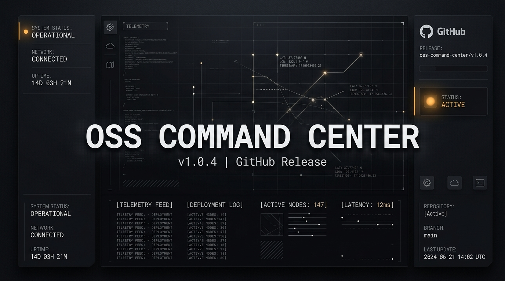
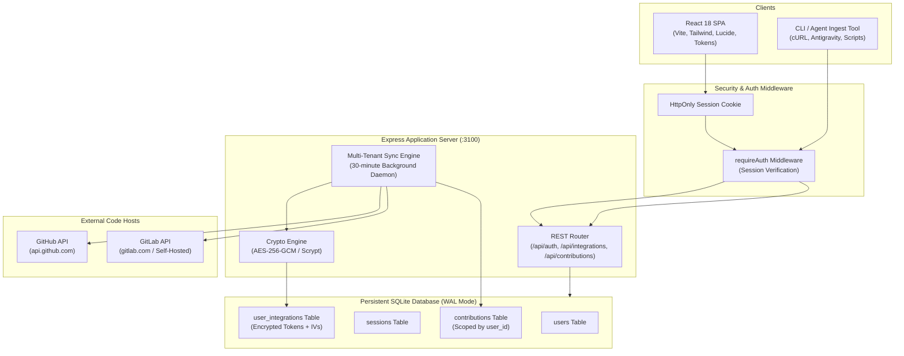

# OSS Command Center

An encrypted, multi-tenant operational command deck for open-source contributors and maintainers to triage, track, and synchronize pull requests and issues across GitHub and GitLab.

[](https://opensource.org/licenses/MIT)
[](https://nodejs.org/)
[](https://www.sqlite.org/wal.html)
[]()
[](https://react.dev/)
[]()

---

## Executive Overview

Tracking open-source contributions across multiple code hosting providers—such as upstream GitHub repositories and self-hosted or institutional GitLab instances—typically leads to notification fatigue and lost context. Review comments, change requests, and approval notifications frequently drown in overflowing email feeds or disjointed platform web UIs.

OSS Command Center addresses this operational bottleneck by offering:
- Private, multi-tenant developer vaults where individual users maintain an isolated database slice.
- Authenticated AES-256-GCM token encryption at rest with ephemeral RAM-only decryption during sync cycles.
- Algorithmic action derivation (`OWE REPLY`, `CHANGES REQ`, `AWAITING MAINTAINER`) directly computed from chronological comment and review histories.
- Zero-cost architecture designed for free cloud deployments (Render.com free tier) or standalone Docker containers.

---

## Security and Cryptographic Hardening

Security is the primary foundation of the OSS Command Center architecture. Personal access tokens, credentials, and user data are safeguarded through multi-layered defense mechanisms:

### 1. Authenticated Secret Encryption at Rest (AES-256-GCM)
- Every personal access token (GitHub PAT, GitLab PAT) is encrypted prior to database insertion using AES-256 in Galois/Counter Mode (GCM).
- Every stored secret receives a unique cryptographically random 96-bit Initialization Vector (IV).
- Authenticated tags (128-bit MAC) verify cipher text integrity upon every decryption operation. Any tampering, byte corruption, or unauthorized database modification causes decryption to immediately fail and abort.
- Plain text tokens are never written to disk, never logged to stdout/stderr, and never exposed in REST API responses (masked boolean flags like `has_token: true` are returned instead).

### 2. Password Hashing via Scrypt
- User passwords are salted with 16 bytes of cryptographically secure random bytes and hashed using Node.js native `crypto.scrypt` with defensive cost factors (`N=16384`, `r=8`, `p=1`).
- Credential comparisons utilize `crypto.timingSafeEqual` to defend against timing side-channel attacks.

### 3. Session Security
- User sessions are tracked via 256-bit cryptographically random tokens (`crypto.randomBytes(32)`).
- Session identifiers are transmitted inside `HttpOnly`, `SameSite=Lax` cookies (with `Secure` enabled in production environments), preventing XSS token harvesting.

### 4. Database-Level Multi-Tenant Isolation
- All contribution, activity event, integration, and session queries enforce strict tenant scoping (`WHERE user_id = ?`).
- SQLite foreign key constraints (`ON DELETE CASCADE`) guarantee that removing a user account cleanly deletes all related integrations, tokens, contributions, and activity records with zero orphaned data.

---

## Core Capabilities

### Algorithmic Action Derivation
Instead of relying on manual state tagging, the background sync engine inspects the complete conversation graph (comments, reviews, review comments, and merge events) and derives actionable status tokens:
- **OWE REPLY**: An upstream maintainer or reviewer posted the latest substantive comment.
- **CHANGES REQ**: An official review requested changes (`CHANGES_REQUESTED`).
- **AWAITING MAINTAINER**: You replied or pushed code changes, and review is pending.

### Staleness and Inactivity Telemetry
- **Active (< 30 days)**: Highlighted for active work.
- **Stale (30–89 days)**: Flagged with an amber warning badge.
- **Dormant (>= 90 days)**: Tagged with a high-visibility hazard badge and visually dimmed in the main list so inactive contributions never clutter active workflows.

### Slide-Over Detail Drawer
Clicking or pressing `Enter` on any contribution opens an interactive inspection drawer without reloading the page or altering filter state. View complete activity timelines, submit notes, and mark items as read.

### Tactical Monospace Interface
Built following a high-density, anti-AI-slop design aesthetic. Features Space Grotesk headers, JetBrains Mono data telemetry, IBM Plex Sans body typography, 90-degree razor borders, and calibrated contrast.

### Rapid Keyboard Shortcuts
- `j` / `Down Arrow`: Move cursor down the contribution list.
- `k` / `Up Arrow`: Move cursor up the contribution list.
- `Enter`: Open slide-over detail drawer.
- `Esc`: Close open drawers, modals, or palettes.
- `Ctrl+K`: Global command palette to instantly filter by repository, title, PR number, or notes.
- `?`: Toggle the Quick Guide and Status Legend modal.

---

## Architectural Diagram



---

## Deployment and Hosting (100% Free Tier)

OSS Command Center is structured to run as a unified service (backend API + compiled frontend bundle) requiring zero paid dependencies.

### Option A: 1-Click Deployment to Render.com (Recommended Free Cloud)

Render offers a free Web Service tier with automated SSL/HTTPS certificates and persistent node execution.

1. Fork or push this repository to your GitHub or GitLab account.
2. Sign up at [Render.com](https://render.com) (free).
3. Click **New +** -> **Blueprint**.
4. Connect your repository. Render detects the included [`render.yaml`](./render.yaml) file automatically:
   - **Runtime**: Node
   - **Build Command**: `npm install && npm run build`
   - **Start Command**: `npm start`
   - **Environment Variables**:
     - `NODE_ENV`: `production`
     - `APP_SECRET_KEY`: Automatically generated 32-byte hex secret
5. Click **Apply**. Within 3 minutes, your OSS Command Center is live at `https://your-service.onrender.com`.

### Option B: Docker Container Self-Hosting

You can run the production container locally or on any cloud server using Docker:

```bash
# Build the production image
docker build -t oss-command-center .

# Run container with persistent data volume
docker run -d \
  -p 3100:3100 \
  -v oss_data:/app/data \
  -e APP_SECRET_KEY=generate_a_random_32_byte_hex_string_here \
  --name oss-command-center \
  oss-command-center
```

Visit `http://localhost:3100` to access the application.

---

## Local Development Setup

### 1. Prerequisites
- **Node.js**: v18.0.0 or higher
- **npm** or **pnpm**

### 2. Installation
```bash
git clone https://github.com/Guts1005/oss-command-center.git
cd oss-command-center
npm install
```

### 3. Environment Configuration
Create a `.env` file in the root directory:
```env
PORT=3100
NODE_ENV=development
APP_SECRET_KEY=32_byte_hex_encryption_key_or_leave_empty_for_auto_generation
```

### 4. Start Development Mode
```bash
# Concurrently launches Express (:3100) and Vite (:5173) with hot reload
npm run dev
```

Navigate to `http://localhost:5173`.

### 5. Running Automated Verification Suites
```bash
# Run complete test suite (Crypto, Database, REST API, Multi-Tenancy)
npm test

# Run individual test suites
npm run test:crypto
npm run test:db
npm run test:api
npm run test:multi
```

---

## User Workflow Guide

### 1. Account Initialization
1. Click **Sign In / Join** in the upper navigation bar.
2. Select **Create Account** and provide your username, email, and password.
3. Your isolated workspace is initialized immediately.

### 2. Linking GitHub and GitLab Accounts
1. Click **Accounts** in the top navigation bar.
2. Select **GitHub** or **GitLab**.
3. Provide your account username and personal access token:
   - **GitHub**: Classic token with `repo` and `read:user`, or Fine-Grained token with Issues and Pull Requests read access.
   - **GitLab**: Personal access token with `read_api` scope.
4. Click **Link Account**. Tokens are encrypted using AES-256-GCM before writing to the database.
5. The background engine runs automatically every 30 minutes, or you can trigger an immediate harvest via **Sync All Accounts**.

### 3. Tracking External PRs or Issues
1. Click **+ Track PR / Issue** or press the quick button in the header.
2. Paste any GitHub or GitLab URL (e.g., `https://github.com/astral-sh/ruff/pull/28429` or `https://gitlab.rtems.org/rtems/rtos/rtems/-/merge_requests/1484`).
3. Set optional metadata (bounty amount, difficulty level, triage notes).
4. Click **Ingest Contribution**.

### 4. Command Line Ingestion (CLI & AI Agents)
You can directly ingest newly discovered issues or bounties from terminal scripts, shell aliases, or autonomous coding agents (`Antigravity`, `Claude Code`, `Cursor`):

```bash
curl -X POST http://localhost:3100/api/ingest \
  -H "Content-Type: application/json" \
  -d '{
    "platform": "github",
    "repo": "vllm-project/vllm",
    "number": 12345,
    "title": "perf: optimize paged attention memory footprint",
    "type": "issue",
    "url": "https://github.com/vllm-project/vllm/issues/12345",
    "author": "developer",
    "difficulty": "hard",
    "bounty_amount": "$500",
    "notes": "Triaged during CLI session"
  }'
```

---

## REST API Reference

| Method | Endpoint | Authentication | Description |
|---|---|---|---|
| `POST` | `/api/auth/register` | Public | Register a new user account with hashed password. |
| `POST` | `/api/auth/login` | Public | Authenticate session and receive HttpOnly cookie. |
| `POST` | `/api/auth/logout` | Optional | Invalidate current session and clear cookie. |
| `GET` | `/api/auth/me` | Required | Retrieve current user profile and linked integration statuses. |
| `GET` | `/api/integrations` | Required | List connected accounts with masked token status. |
| `POST` | `/api/integrations` | Required | Connect or update a platform account with AES-256-GCM encryption. |
| `DELETE`| `/api/integrations/:id` | Required | Disconnect a linked account and remove stored tokens. |
| `POST` | `/api/integrations/sync` | Required | Trigger an immediate sync across all accounts for the authenticated user. |
| `GET` | `/api/stats` | Scoped | High-level metrics (`total`, `actionNeeded`, `awaitingMaintainer`, `merged`, `unreadCount`, `lastSync`). |
| `GET` | `/api/contributions` | Scoped | Query contributions with filters (`?status=...&platform=...&action=...&search=...&sort=...`). |
| `GET` | `/api/contributions/:id` | Scoped | Retrieve full contribution detail and timeline; marks item as read. |
| `PATCH` | `/api/contributions/:id/notes` | Scoped | Update triage notes, next action state, difficulty, or bounty amount. |
| `POST` | `/api/ingest` | Scoped | Ingest a new contribution or issue directly from CLI or API. |

---

## License

Distributed under the **MIT License**. See [`LICENSE`](./LICENSE) for terms.
