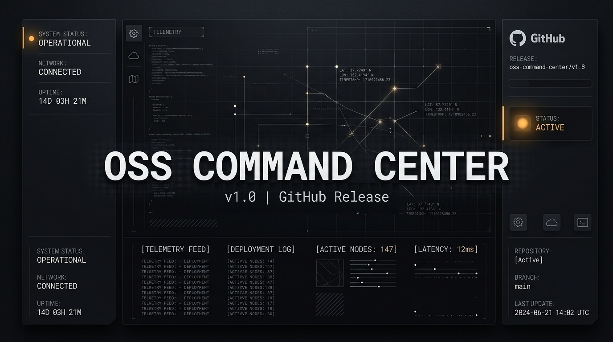

# OSS Command Center

A high-density operational cockpit for open-source contributors and maintainers to track, triage, and synchronize contributions across GitHub and GitLab in one unified feed.

---

### [Launch OSS Command Center (Live Web App)](https://oss-command-center.onrender.com)

Access the live production instance directly in your browser. No local installation, environment configuration, or cloud provisioning required.

---

## Why OSS Command Center? (The Problem with Native Platform Inboxes)

Developers often ask: *"GitHub and GitLab already have notification tabs and PR lists. Why do I need a dedicated command deck?"*

If you only contribute to one repository once a month, native tabs are sufficient. But for active open-source engineers, maintainers, and bounty hunters, native platform interfaces create critical operational bottlenecks:

### 1. GitHub Tells You What Happened. OSS Command Center Tells You What to Do Next.
Native platform inboxes display raw chronological events (comments, bot CI logs, workflow pings, tag releases). They force you to manually open every pull request, scroll past dozens of comments, and mentally calculate: *"Did the maintainer ask me a question, or am I waiting on them?"*

OSS Command Center programmatically evaluates conversation timelines, review decisions, and commit graphs to derive deterministic action states:
- **OWE REPLY**: An upstream maintainer or reviewer asked a question or left feedback that requires your input.
- **CHANGES REQ**: An official review requested revisions before work can proceed.
- **AWAITING MAINTAINER**: You pushed code or replied; the ball is in their court. No action is required from you today.

### 2. Unified GitHub and GitLab Aggregation
Real-world open source is distributed across multiple ecosystems. Infrastructure and systems projects (such as RTEMS, GNOME, or institutional enterprise repos) run on self-hosted or cloud GitLab instances. Machine learning, tooling, and web projects live on GitHub.

GitHub knows nothing about your GitLab merge requests, and GitLab knows nothing about your GitHub pull requests. OSS Command Center unifies all your external contributions into a single prioritized queue.

### 3. Staleness and Upstream Drift Telemetry
When pull requests sit unreviewed, codebases drift and merge conflicts accumulate. Native platforms do not warn you when your contributions are going cold. 

OSS Command Center categorizes and visually flags age and drift (Active, Stale 30d+, Dormant 90d+) so you know exactly which maintainers to ping, which branches need rebasing, and which stagnant work to close before merge rot sets in.

### 4. Zero Context Switching (Instant Slide-Over Inspection)
Opening 15 pull requests in GitHub opens 15 heavy browser tabs. OSS Command Center features an instant slide-over inspection drawer that opens in real time without refreshing the page, losing your filter state, or cluttering your browser with tabs.

### 5. Private Contributor Metadata
GitHub provides no way to attach private notes, bounty targets, difficulty ratings, or triage checklists to pull requests in repositories you do not own. OSS Command Center gives you a private operational layer to store notes, deadlines, and bounty values directly on any tracked item.

---

## Core Capabilities

### Algorithmic Action Derivation
Stop digging through notification emails. Your feed categorizes contributions automatically into three unambiguous states:
- `OWE REPLY` (Amber badge): Upstream maintainer posted the latest substantive comment.
- `CHANGES REQ` (Red badge): Formal review requested changes.
- `AWAITING MAINTAINER` (Blue badge): Code pushed or question answered; awaiting review.

### Cross-Platform Ingestion
Track pull requests and issues from:
- GitHub (`github.com`)
- GitLab Cloud (`gitlab.com`)
- Self-Hosted or Institutional GitLab instances (e.g., `gitlab.rtems.org`)

### Inactivity and Staleness Indicators
- **Active (< 30 days)**: Highlighted for active iteration and reviews.
- **Stale (30 to 89 days)**: Flagged with amber indicators to signal aging reviews.
- **Dormant (>= 90 days)**: Tagged with a hazard badge and visually dimmed to prevent dead contributions from cluttering your active queue.

### High-Density Monospace Ergonomics
Built for engineers who value screen real estate and keyboard navigation:
- Monochromatic slate and sapphire visual foundation.
- Full keyboard traversal (`j`/`k` list navigation, `Enter` to inspect).
- Global command palette (`Ctrl+K`) for sub-second filtering across titles, numbers, repositories, and notes.

---

## Security and Privacy Guarantees

Connecting developer credentials to any tool requires uncompromising security hygiene. OSS Command Center was built from day one around strict defensive principles:

### 1. Zero-Trust Credential Isolation
Personal access tokens are stored in an encrypted private vault and decrypted only ephemerally in volatile memory during active synchronization cycles. Plaintext tokens are never written to disk, never logged to stdout/stderr, and never transmitted in client-side API responses.

### 2. Strict Principle of Least Privilege
The platform functions entirely on minimal, read-only permissions.
- **GitHub**: Requires only public repository read access (`public_repo`, `read:user`) or Fine-Grained read-only tokens for Pull Requests and Issues.
- **GitLab**: Requires only `read_api` scope.
- **No Write Permissions**: The platform never requests write permissions, commit signing access, organization admin rights, or repository deletion privileges.

### 3. Zero Third-Party Exfiltration and Zero Tracking
OSS Command Center operates with zero third-party analytics scripts, zero tracking pixels, and zero session recording software. All outbound requests travel exclusively and directly between your secure authenticated session and official code hosting endpoints (`api.github.com` and `gitlab.com`).

### 4. Cryptographically Segmented Multi-Tenant Privacy
Every user account operates within an isolated tenant boundary. Your tracked repositories, private triage notes, and connected accounts are strictly partitioned to your workspace. Cross-account data visibility is architecturally blocked.

### 5. Instant Revocation and Complete Data Eradication
You maintain full sovereignty over your data. Disconnecting a platform or deleting your account immediately executes an atomic purge of all associated tokens, credentials, and contribution history with zero retention.

---

## Getting Started in 3 Steps

### Step 1: Open the Live Application
Navigate to the hosted instance at [oss-command-center.onrender.com](https://oss-command-center.onrender.com) and create your private workspace account.

### Step 2: Connect Your Developer Handles
1. Click **Accounts** in the top navigation bar.
2. Select **GitHub** or **GitLab**.
3. Provide your username and a read-only personal access token:
   - For GitHub: A fine-grained personal access token with read-only access to Pull Requests and Issues (or a classic token with `read:user` and `public_repo`).
   - For GitLab: A personal access token with `read_api` scope.
4. Click **Link Account**. Your tokens are immediately encrypted into your private vault.

### Step 3: Triage and Track
- Click **Sync All Accounts** to pull your latest PRs and issues across all connected platforms.
- Use **+ Track PR / Issue** to paste specific links you want to monitor (including bounty amounts, difficulty tags, and private notes).
- Press `Ctrl+K` to search or filter across your entire open-source portfolio.

---

## Keyboard Command Reference

| Shortcut | Action | Scope |
|---|---|---|
| `j` or `Down Arrow` | Move cursor down the contribution list | Main feed |
| `k` or `Up Arrow` | Move cursor up the contribution list | Main feed |
| `Enter` | Open slide-over detail drawer for selected item | Main feed |
| `Esc` | Close open drawers, modals, or command palette | Global |
| `Ctrl+K` | Open global command palette search | Global |
| `?` | Toggle Quick Guide and status legend | Global |

---

## License

Distributed under the **MIT License**. See [`LICENSE`](./LICENSE) for full details.
